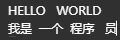

# Android_Speed_Scanner
急速扫描仪是一款简易的OCR识别App，旨在让您的设备变成随身携带的扫描仪。无论是拍照扫描、相册上传还是文档扫描，它都能瞬间将图片文字转换为可编辑文本，极大提升学习办公效率。

------

这是本人开发的一个Android OCR扫描类应用，在此项目中使用的中英文本地OCR识别是github上的一个开源库中的（https://github.com/equationl/paddleocr4android/）。在此之前我做过一个类似的应用，但是之前那个是把整个模型和所依赖的文件库都给放到项目中（CMake之类的），在这项目中我做了全新的调整，OCR识别还融合了Google ML KIT文字识别以支持更多的语种，因为开源库中好像只支持中英文的识别。而且该库中的模型无法还原结果中数据原本的格式，所以在此项目中我自定义了一个格式还原的功能。在ML KIT里面有韩语、日语等等（具体支持的语言可以进入这里看https://developers.google.cn/ml-kit/vision/text-recognition/v2/languages?hl=zh-cn）。

由于不太容易能够知道图片中的语言是哪一种所以我将切换OCR识别语言给放到了设置中作为一个设置项，用户可以在设置界面手动切换调用OCR的方式。并且App是支持国际化的，当你更换App显示的语言时OCR识别语言也会自动切换到对应的语言。

此App主要有相机扫描、相册上传、文档扫描和二维码扫描这四个功能，前三个在内部都是调用上述我提到的OCR识别方式进行文字提取的，只不过在进入识别之前的步骤不一样，我将OCR识别封装成了一个工具方便大家更换或者扩展。以上我提到的主要功能都已实现，其他部分小的功能还有待完善，在压缩包install_package.zip中有该App的安装包，大家可以下载到手机体验。

------

##### 界面预览：

         

##### 项目架构：

1. PaddleOCR：本地中英文识别引擎
2. Google ML Kit：多语言云端识别
3. OpenCV：图像处理与文档矫正
4. Jetpack Compose：现代化UI框架

##### 主要功能实现过程：

这里我只会说明项目中一些相对重要功能的大致实现过程，如果你对其它实现感兴趣的话可以下载源码查看具体细节，你也可以按照你自己的需求修改某些功能或者添加其他功能。

1. 二维码扫描

   这个功能相对比较简单官方教程在这里（[Google 扫码器（仅限 Android）  | ML Kit  | Google for Developers](https://developers.google.cn/ml-kit/vision/barcode-scanning/code-scanner?hl=zh-cn)），只需要将依赖添加到项目中然后通过GmsBarcodeScannerOptions配置扫描的二维码格式，再通过它构建一个GmsBarcodeScanner实例。最后利用实例去调用startScan方法就能开启扫描，Google扫描器它有自带的相机界面而且它能自动捕捉二维码触发扫描，在回调addOnSuccessListener中可以获取扫描的结果，我在这里加了一个链接自动打开的功能。只要开头是http://或者是https://都会自动通过Intent自动跳转浏览器打开链接，以下是该功能的详细实现。

   ```kotlin
   //创建GmsBarcodeScannerOptions扫描器选项
   var scannerOptions = GmsBarcodeScannerOptions
   .Builder()
   //设置扫描的类型
   .setBarcodeFormats(
       Barcode.FORMAT_QR_CODE,
       Barcode.FORMAT_AZTEC,
       Barcode.FORMAT_CODABAR,
       Barcode.FORMAT_CODE_128,
       Barcode.FORMAT_CODE_39,
       Barcode.FORMAT_CODE_93,
       Barcode.FORMAT_DATA_MATRIX,
       Barcode.FORMAT_EAN_13,
       Barcode.FORMAT_EAN_8,
       Barcode.FORMAT_ITF,
       Barcode.FORMAT_PDF417,
       Barcode.FORMAT_UPC_A,
       Barcode.FORMAT_UPC_E
   )
   //开启自动缩放
   .enableAutoZoom()
   .build()
   
   //GmsBarcodeScanner实例
   val scanner = GmsBarcodeScanning.getClient(this,scannerOptions)
   //启动
   scanner.startScan()
   .addOnSuccessListener { barcode ->
                          if (barcode == null){
                              Log.w(TAG, "扫码结果为空");
                              Toast.makeText(this@MainActivity,getString(R.string.code_scan_res_empty), Toast.LENGTH_SHORT).show();
                          }else{
                              var res = barcode.rawValue
                              Log.d(TAG, "扫码结果: $res")
                              if (!res.isNullOrEmpty()){
                                  //如果是链接那么直接用浏览器打开
                                  if (res.startsWith("http://") || res.startsWith("https://")){
                                      val intent = Intent(Intent.ACTION_VIEW, Uri.parse(res))
                                      startActivity(intent)
                                      // 链接也保存到数据库历史记录中去
                                      ocrRecordViewModel.addRecord(
                                          type = ScanType.SCAN_CODE,
                                          content = res,
                                          imagePath = null
                                      )
                                      Log.d(TAG, "链接已保存到数据库")
                                  } else {
                                      //不是链接 跳转到结果页面
                                      isFromHistory.value = false
                                      ocrResultBitmap.value = null
                                      ocrResultText.value = res
                                      ocrResultImagePath.value = null
                                      ocrResultScanType.value = ScanType.SCAN_CODE
                                      showOcrResult.value = true
                                      Log.d(TAG, "扫码结果跳转到结果页面")
                                  }
                              }
                          }
                         }
   .addOnCanceledListener {
       Toast.makeText(this@MainActivity, getString(R.string.cancel_code_scan), Toast.LENGTH_SHORT).show()
   }
   .addOnFailureListener { e ->
                          Log.e(TAG,"异常："+e.message)
                          Toast.makeText(this@MainActivity, getString(R.string.code_scan_err), Toast.LENGTH_SHORT).show()
                         }
   ```

2. 拍照识别

   此功能主要是拍照直接提取文本，所以需要请求手机的相机权限才行，拍照后会带着图片跳转到一个识别区域选择的页面。在此页面上你需要根据你的需要移动页面上的方框去调整识别的区域。当你选定好区域点击确认后会调用我封装好的一个图片处理工具ImagePreprocessingUtil，里面有图像矫正和文字增强两个方法，这些图像处理的方法主要是通过OpenCV来实现的。然后接下来会传递上一步中用户选择好区域的4个点（点在原图像中的xy坐标）和原始图像，然后执行图像矫正增强，最后将处理好的图像进行OCR识别。

   检查相机权限：

   ```kotlin
   private fun openCamera() {
       // 检查相机权限
       when {
           ContextCompat.checkSelfPermission(
               this,
               Manifest.permission.CAMERA
           ) == PackageManager.PERMISSION_GRANTED -> {
               //权限已授予，直接打开相机
               launchCamera()
           }
           else -> {
               //请求权限
               val permissions = mutableListOf(Manifest.permission.CAMERA)
   
               //Android13以下需要存储权限
               if (Build.VERSION.SDK_INT < Build.VERSION_CODES.TIRAMISU) {
                   permissions.add(Manifest.permission.READ_EXTERNAL_STORAGE)
                   permissions.add(Manifest.permission.WRITE_EXTERNAL_STORAGE)
               }
               requestPermissionLauncher.launch(permissions.toTypedArray())
           }
       }
   }
   ```

   图像矫正逻辑：

   ```java
   public Bitmap manualDocumentCorrection(Bitmap sourceBitmap, Point[] cornerPoints) {
       try {
           //将Bitmap转换为Mat，确保正确的颜色通道顺序
           Mat sourceMat = new Mat();
           //把输入的Bitmap拷贝成ARGB_8888格式 确保每像素32位便于OpenCV操作
           Bitmap bmp32 = sourceBitmap.copy(Bitmap.Config.ARGB_8888, true);
           //类型转换 将Bitmap类型转换成OpenCV的Mat类型
           Utils.bitmapToMat(bmp32, sourceMat);
           // 处理RGBA到BGR的转换 OpenCV中默认使用BGR 而Android是RGBA 这一步把颜色格式转换成OpenCV标准的BGR
           Imgproc.cvtColor(sourceMat, sourceMat, Imgproc.COLOR_RGBA2BGR);
           // 确保角点不为空且有效 校验角点一定要是四个而且不能为空
           if (cornerPoints == null || cornerPoints.length != 4) {
               Log.e(TAG, "角点无效，无法进行校正");
               return null;
           }
           // 使用用户选择的角点
           Point[] userSelectedCorners = cornerPoints;
           // 调试日志，输出选择的角点坐标
           for (int i = 0; i < userSelectedCorners.length; i++) {
               Log.d(TAG, "角点" + i + ": x=" + userSelectedCorners[i].x + ", y=" + userSelectedCorners[i].y);
           }
           // 计算图像的宽度和高度 用于拉直
           double topWidth = Math.sqrt(Math.pow(userSelectedCorners[1].x - userSelectedCorners[0].x, 2) +
                                       Math.pow(userSelectedCorners[1].y - userSelectedCorners[0].y, 2));
           double bottomWidth = Math.sqrt(Math.pow(userSelectedCorners[2].x - userSelectedCorners[3].x, 2) +
                                          Math.pow(userSelectedCorners[2].y - userSelectedCorners[3].y, 2));
           //计算上边和下边的长度，取最大值作为图像的宽度 
           double finalWidth = Math.max(topWidth, bottomWidth);
           //这里也是一样
           double leftHeight = Math.sqrt(Math.pow(userSelectedCorners[3].x - userSelectedCorners[0].x, 2) +
                                         Math.pow(userSelectedCorners[3].y - userSelectedCorners[0].y, 2));
           double rightHeight = Math.sqrt(Math.pow(userSelectedCorners[2].x - userSelectedCorners[1].x, 2) +
                                          Math.pow(userSelectedCorners[2].y - userSelectedCorners[1].y, 2));
           //计算左右边的长度，取最大值作为图像的高度
           double finalHeight = Math.max(leftHeight, rightHeight);
           // 检查计算出的宽度和高度是否有效 判断文档的尺寸是否太小了 如果太小可能是选错点了
           if (finalWidth <= 10 || finalHeight <= 10) {
               Log.e(TAG, "计算出的文档尺寸过小，无法进行校正: " + finalWidth + "x" + finalHeight);
               return null;
           }
           // 使用固定的纵横比例 避免奇怪的形变 如果宽高比例不合理 自动调整为A4纸比例。
           double aspectRatio = finalWidth / finalHeight;
           if (aspectRatio < 0.5 || aspectRatio > 2.0) {
               Log.w(TAG, "纵横比例异常 (" + aspectRatio + ")，使用标准A4比例");
               aspectRatio = 210.0 / 297.0; // A4纸比例
               finalHeight = finalWidth / aspectRatio;
           }
           // 设置合理的分辨率 为了防止生成太大的图像，占用内存，这里设置了最大宽高
           int maxSize = 2000; 
           if (finalWidth > maxSize) {
               finalWidth = maxSize;
               finalHeight = finalWidth / aspectRatio;
           }
           if (finalHeight > maxSize) {
               finalHeight = maxSize;
               finalWidth = finalHeight * aspectRatio;
           }
           // 显示识别后的宽高
           Log.i(TAG, "手动选择的文档尺寸: " + (int)finalWidth + "x" + (int)finalHeight);
           // 创建源点和目标点  srcPoints：用户选择的原图中的四个角点  dstPoints：变换后的矩形目标区域
           MatOfPoint2f srcPoints = new MatOfPoint2f(
               userSelectedCorners[0], // 左上
               userSelectedCorners[1], // 右上
               userSelectedCorners[2], // 右下
               userSelectedCorners[3]  // 左下
           );
           //获取透视变换矩阵 计算从srcPoints到dstPoints 的透视变换矩阵
           MatOfPoint2f dstPoints = new MatOfPoint2f(
               new Point(0, 0),                    // 左上
               new Point(finalWidth - 1, 0),       // 右上
               new Point(finalWidth - 1, finalHeight - 1), // 右下
               new Point(0, finalHeight - 1)       // 左下
           );
           // 获取透视变换矩阵 计算从srcPoints到dstPoints的透视变换矩阵
           Mat perspectiveTransform = Imgproc.getPerspectiveTransform(srcPoints, dstPoints);
           // 检查变换矩阵是否有效
           if (perspectiveTransform.empty()) {
               Log.e(TAG, "透视变换矩阵计算失败");
               return null;
           }
           // 应用透视变换
           Mat warpedMat = new Mat((int)finalHeight, (int)finalWidth, CvType.CV_8UC3);
           //用变换矩阵将文档拉直
           Imgproc.warpPerspective(sourceMat, warpedMat, perspectiveTransform, warpedMat.size());
           // 检查变换结果是否有效
           if (warpedMat.empty() || warpedMat.cols() == 0 || warpedMat.rows() == 0) {
               Log.e(TAG, "透视变换失败，结果为空");
               return null;
           }
           // 应用增强处理 直接在透视变换后应用图像增强
           Mat enhancedMat = enhanceDocumentImage(warpedMat);
           // 转换回Bitmap
           Bitmap resultBitmap = Bitmap.createBitmap((int)finalWidth, (int)finalHeight, Bitmap.Config.ARGB_8888);
           // 转回RGBA格式 使用增强后的Mat
           Imgproc.cvtColor(enhancedMat, enhancedMat, Imgproc.COLOR_BGR2RGBA);
           Utils.matToBitmap(enhancedMat, resultBitmap);
           // 释放Mat资源
           sourceMat.release();
           warpedMat.release();
           enhancedMat.release();
           perspectiveTransform.release();
           return resultBitmap;
       } catch (Exception e) {
           Log.e(TAG, "文档校正时出错: " + e.getMessage());
           e.printStackTrace();
           return null;
       }
   }
   ```

3. 文档扫描

   这里我使用的是mlkit-document-scanner这个也是Google提供的，它有内置的扫描相机预览页面，并且它还提供了自动捕捉文档区域的功能，当你的文档完全出现在画面中间是会有一个框自动捕捉区域并执行我的OCR识别逻辑。更加好用的是，它还会自动透视变换和图像增强让文档照片看起来有真的A4纸的效果。首先需要导入以下依赖：

   ```kotlin
   implementation("com.google.android.gms:play-services-mlkit-document-scanner:16.0.0")
   ```

   然后实例化 GmsDocumentScannerOptions配置扫描器选项，你可以选择最大处理页数、处理的类型等。然后再通过GmsDocumentScanning获取一个GmsDocumentScanner实例完成扫描一些处理逻辑，这里我不再继续过多的说明这些实现的具体代码，大家感兴趣的话可以下载源码查看。

4. 文本格式还原

   我写这个的原因主要是我在使用paddleocr4android这个库的OCR识别时，我发现有些情况下它并没有自动对识别的结果进行格式还原（我这里的格式还原指的是和原图中的格式保持一致），下面是我用来测试识别效果的图片：

    
   在这个图片中有两行文字，实际上在原始paddleocr4android识别中它的结果HELLO和WORLD这两个词是分开的并且不是在同一行，所以我决定自己实现一下格式还原的功能。该库依赖项目中assets/models目录下的模型文件，分别是cls文字方向分类、det文本检测和rec文本识别。在文本检测中模型会将图像中的文字或者词语完整区域给框出来，也就是一个矩形，模型会输出矩形四个角在图像中的坐标，这里我稍微说明一下在计算机图像处理中坐标系原点是在图像的左上角的。

   所以我需要通过这些坐标位置来判断输出的文字是否在同一行而且是否在文字之间存在空格，具体的实现逻辑是：

   1. 根据模型的输出解析出所有点的坐标，但是只需要我们关心的部分（最大x、最小x、最大y、最小y、中心点的y轴坐标），以下是我自定义的文本块信息类。

      ```java
      class TextBlock {
          //识别到的文本内容
          String text;
          //文本框最上边的y坐标
          int minY;
          //文本框最下边的y坐标
          int maxY;
          //文本框最左边的x坐标
          int minX;
          //文本框最右边的x坐标
          int maxX;
          //文本框最中间的y坐标
          int centerY;
      
          public TextBlock(String text, int minY, int maxY, int minX, int maxX) {
              this.text = text;
              this.minY = minY;
              this.maxY = maxY;
              this.minX = minX;
              this.maxX = maxX;
              this.centerY = (minY + maxY) / 2;
          }
      }
      ```

   2. 文本块可能是一个也可能是多个，在多个的情况下我们要将其排序，根据centerY中间点Y轴坐标升序排列以保证集合中TextBlock的顺序是从左到右从上到下的。

   3. 接下来开始遍历集合将同一行的TextBlock放到同一个集合里面，这里我定义了一个上下浮动阈值，我根据这个阈值去判断前后两个TextBlock的centerY中间点坐标是否在这个阈值内，如果在那么放到同一行的集合，这里是分行。

   4. 分好行的集合大概是这样的结构List<List<TextBlock>>每一行都是一个独立的集合，接下来遍历这个集合然后取出小的集合，根据minX升序排序以保证TextBlock的顺序是从左往右的。

   5. 最后遍历每一行的集合，处理逻辑和上面差不多，判断前后两个文本块之间的距离这里我也定义了一个阈值。用后一个的minX减去前一个的maxX，这样就能得出前后两个之间的距离，如果距离小于等于0那么不用填充直接拼接。假如大于了我定义的阈值，那么用得出的间隔去除以阈值得出中间需要填充的空格数量，以下是结果格式还原后的日志输出：

       

      说明一下阈值你可以根据自己的需求去动态调整不同的阈值会有不同的效果，我返回的结果是一个集合，所以在日志中可以看到两行文字之间有一个","这并不是格式还原的逻辑有问题。还有在测试原图中第二行数据应该是"我是 一个 程序   员"，仔细看可以发现"程序"和"员"之间的距离是更加远的，而前面的部分都挨的比较近。所以我这里的自动空格只对最后的一个字起了作用，这是因为阈值设太大导致前面的空格没有加上去，总之阈值可以根据你自己的需求去设置。